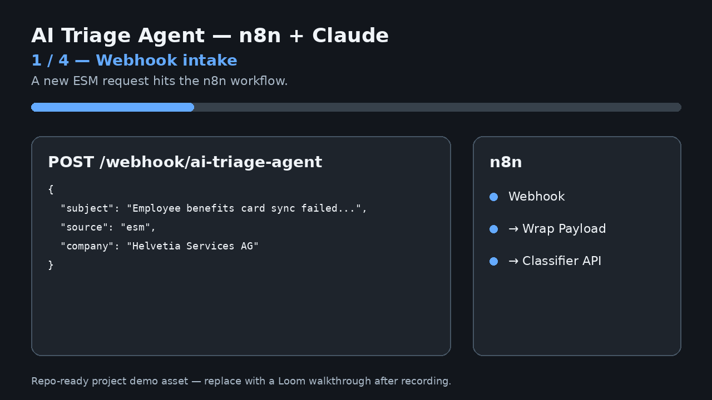
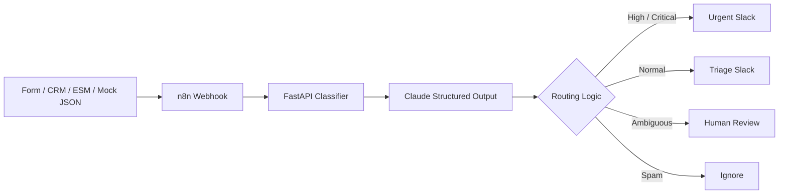

# AI Triage Agent — n8n + Claude Structured Routing



A project that turns incoming business requests into **structured triage decisions** and routes them through an **n8n automation workflow**.

---

## Demo

**Flow:**  
`Webhook → n8n → Python classifier API → Claude structured output → route to Slack / human review`


---

## Repository structure

```text
.
├── workflow.json
├── README.md
├── .env.example
├── docker-compose.yml
├── Dockerfile
├── requirements.txt
├── pyproject.toml
├── Makefile
├── src/
│   └── triage_agent/
│       ├── api.py
│       ├── claude_classifier.py
│       ├── config.py
│       ├── normalizers.py
│       ├── prompts.py
│       ├── router.py
│       └── schemas.py
├── examples/
│   ├── sample_payload_hr.json
│   ├── sample_payload_urgent_ops.json
│   ├── typeform_like_payload.json
│   └── expected_output_example.json
├── tests/
│   ├── test_normalizers.py
│   ├── test_router.py
│   └── test_schema.py
├── scripts/
│   ├── send_test_webhook.sh
│   └── test_classifier_api.sh
└── docs/
    ├── AGENT_REGISTRY.md
    ├── ARCHITECTURE.md
    ├── DEMO_SCRIPT.md
    ├── PROJECT_BRIEF.md
    └── ROLE_ALIGNMENT.md
```

---

## What the classifier returns

Example fields:

```json
{
  "intent": "technical_issue",
  "urgency": "high",
  "confidence": 0.96,
  "summary": "A company reports that an employee sync is blocked before payroll closing.",
  "recommended_owner": "tech",
  "recommended_action": "Escalate to integrations support and verify the CRM import job status.",
  "sla_hours": 4,
  "needs_human_review": false
}
```

---

## Local setup

### 1. Clone and configure

```bash
git clone <your-repo-url>
cd ai-triage-agent
cp .env.example .env
```

Fill in:
- `ANTHROPIC_API_KEY`
- `SLACK_WEBHOOK_URL`

### 2. Run with Docker

```bash
docker compose up --build
```

This starts:
- FastAPI classifier service on `http://localhost:8000`
- n8n on `http://localhost:5678`

### 3. Import the n8n workflow

In n8n:
1. Open the workspace.
2. Import `workflow.json`.
3. Activate the workflow.
4. Copy the production webhook URL or use:
   `http://localhost:5678/webhook/ai-triage-agent`

### 4. Trigger the end-to-end demo

```bash
bash scripts/send_test_webhook.sh
```

You should see:
- a structured API response
- a Slack message sent through the configured webhook

---

## Run the classifier API without n8n

```bash
python -m pip install -r requirements.txt
PYTHONPATH=src uvicorn triage_agent.api:app --reload --port 8000
bash scripts/test_classifier_api.sh
```

Health check:
```bash
curl http://localhost:8000/health
```

---

## Tests

```bash
make test
```

The tests cover:
- payload normalization
- route selection logic
- schema contract sanity checks

---

## n8n workflow logic

The importable `workflow.json` does:

1. **Webhook node** receives a POST request.
2. **Code node** wraps input as `{ "payload": ... }`.
3. **HTTP Request node** calls the Python classifier API.
4. **Switch node** routes by `route`:
   - `slack_urgent`
   - `slack_triage`
   - `email_fallback` / human review
   - fallback output for ignored requests
5. **Slack formatting** converts the structured result into a concise notification.
6. **Respond to Webhook** returns the final result.

---

## Claude integration

The classifier service:
- sends the normalized request to Claude
- asks for a strict schema-constrained output
- validates the response with Pydantic before routing

The model is configured by environment variable:
```bash
ANTHROPIC_MODEL=claude-sonnet-4-6
```


---

## Operational maturity built into the repo

This is intentionally **not** a toy demo. It includes:
- `.env` separation
- no hardcoded secrets
- Docker runtime
- unit tests
- schema validation
- human review path
- project brief
- architecture diagram
- live agent registry
- metrics and rollout ideas

---

## Security note

Do **not** commit:
- API keys
- webhook URLs
- SMTP passwords
- OAuth credentials
- production payloads containing personal data

Use `.env` locally and secret management in production.


