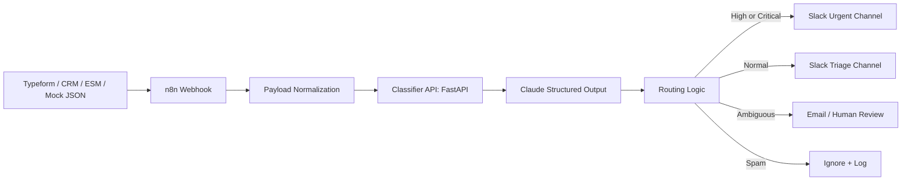

# Architecture

## Design choices

### 1. n8n for orchestration
The workflow is visible to business stakeholders, easy to demo, and directly maps to low-code automation work.

### 2. Python classifier API
The Claude integration is isolated in a small service so the n8n workflow stays readable and reusable. This also makes unit tests possible.

### 3. Strict structured output
The classifier uses a JSON Schema contract so the downstream workflow can route on stable fields such as `urgency`, `intent`, and `recommended_owner`.

### 4. Human review path
Low-confidence or ambiguous cases are explicitly routed for review. This shows operational maturity rather than over-automating.

### 5. Portfolio relevance
This project demonstrates:
- AI agent/automation design
- API integration
- Low-code orchestration
- Business process thinking
- Cross-functional documentation
- Monitoring and deployment discipline
